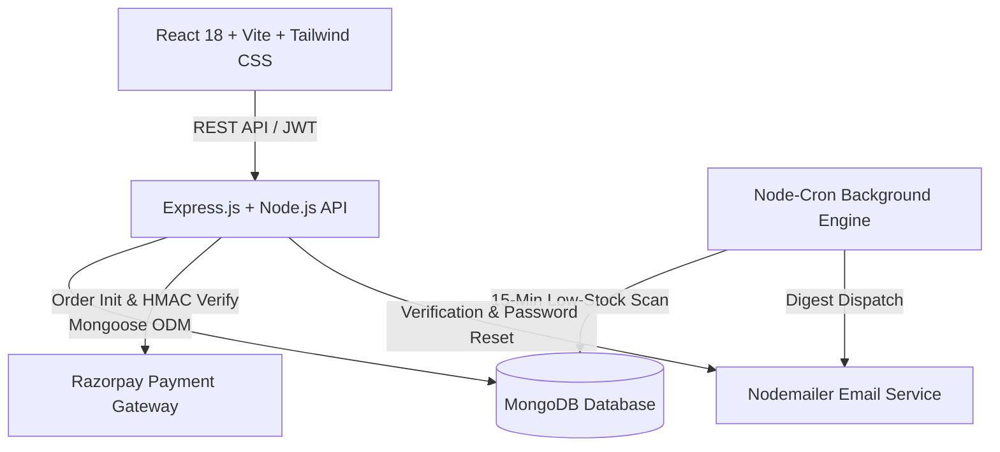

# SliceHub — Full-Stack Real-Time Pizza Ordering & Kitchen Inventory Platform 🍕

[](https://nodejs.org/)
[](https://react.dev/)
[](https://www.mongodb.com/)
[](https://tailwindcss.com/)
[](LICENSE)

**Oasis Infobyte SIP — Level 3 Web Development & Designing Project**  
**Author:** Ahmed Iqbal  
**Architecture:** MERN Stack (MongoDB, Express, React, Node.js) with Tailwind CSS, 3D Canvas, and Razorpay Checkout  

---

## 🌟 Executive Summary

**SliceHub** is an industrial-grade, full-stack pizza ordering and kitchen inventory platform designed with visual excellence, atomic database operations, real-time live order polling, and automated inventory threshold alert management.

### Key Applications:
1. **Customer Experience Portal**:
   - 🍕 **4-Step Artisan Builder**: Interactive step-by-step dough, sauce, cheese, and farm topping customizer with a persistent real-time price & snapshot summary rail.
   - 💳 **Razorpay Checkout**: Seamless test-mode & production checkout with server-side HMAC-SHA256 signature verification and atomic multi-ingredient stock decrement.
   - ⏱️ **Live Oven Tracker**: Real-time 5-second polling status stepper displaying preparation stages (*Order Received → In Kitchen → Sent to Delivery*).
   - 🔐 **Secure Authentication**: JWT-based session auth with bcrypt hashing, email verification, and password reset workflows.

2. **Admin Operations Management**:
   - 📊 **Real-time Stock Monitor**: Instant visual breakdown of all 21 catalog ingredients, live threshold alerts, and inline stock/pricing management.
   - 🧑‍🍳 **Kitchen Order Dispatch Queue**: Live pipeline for kitchen staff to manage pending tickets and advance order statuses with immediate customer synchronization.
   - ⏰ **Node-Cron Automated Alerts**: Background cron job monitoring inventory levels and dispatching consolidated email digests with 60-minute throttling.

---

## 🏗️ Architecture & Technology Stack



| Layer | Technologies | Description |
|---|---|---|
| **Frontend** | React 18, Vite, Tailwind CSS | High-performance SPA with custom design tokens, dark glassmorphism & responsive mobile drawers |
| **Visuals & Icons** | Lucide React, Canvas Confetti | Modern UI icons & payment completion celebration animations |
| **Backend API** | Node.js, Express.js | Modular REST endpoints with JWT role-based middleware & error handling |
| **Database** | MongoDB & Mongoose | Schemas with preserved item snapshots & atomic `$inc` stock adjustments |
| **Payment Gateway** | Razorpay Node SDK | Test-mode simulation & production HMAC-SHA256 signature verification |
| **Cron Engine** | `node-cron` | Automated background inventory scanner running at 15-minute intervals |
| **Email Service** | Nodemailer | Transactional verification links, password resets, and admin low-stock alerts |

---

## 🚀 Quick Setup & Local Execution

### Prerequisites
- [Node.js](https://nodejs.org/) (v18 or higher recommended)
- [MongoDB](https://www.mongodb.com/) (Local instance on `mongodb://127.0.0.1:27017/slicehub` or MongoDB Atlas URI)

### 1. Clone & Navigate
```bash
git clone https://github.com/axediqbal/OasisInfobytePizzadeliverySystem.git
cd OasisInfobytePizzadeliverySystem/OIBSIP/WebDev-L3-SliceHub
```

### 2. Environment Configuration
Create `.env` inside `server/` or copy from `.env.example`:
```env
MONGO_URI=mongodb://127.0.0.1:27017/slicehub
PORT=5000
JWT_SECRET=super_secret_jwt_slicehub_key_production_2026
RAZORPAY_KEY_ID=rzp_test_slicehub_demo
RAZORPAY_KEY_SECRET=razorpay_secret_slicehub_demo
SMTP_HOST=smtp.gmail.com
SMTP_PORT=587
SMTP_USER=admin@slicehub.test
SMTP_PASS=demo_pass_placeholder
CLIENT_URL=http://localhost:5173
ADMIN_EMAIL=admin@slicehub.test
```

### 3. Install Dependencies
```bash
# Install Server Dependencies
cd server
npm install

# Install Client Dependencies
cd ../client
npm install
```

### 4. Database Seeding
Populate the database with all 21 catalog ingredients and the default admin account:
```bash
cd ../server
node seed.js
```

### 5. Start Servers
```bash
# Start Backend (Port 5000)
cd server
npm start
# or: node server.js

# Start Frontend (Port 5173) in a new terminal
cd client
npm run dev
```

Visit **`http://localhost:5173`** in your browser!

---

## 🧪 Automated Testing Suite

SliceHub includes a comprehensive automated test runner covering 100% of customer and admin workflows:
```bash
cd OIBSIP/WebDev-L3-SliceHub/server
node test-runner.js
```

### Verified Test Suites (49/49 Passing):
- ✅ **API Health & MongoDB Connectivity**
- ✅ **User Registration, Verification Token Handling & Email Activation**
- ✅ **JWT Authentication & RBAC Route Protection**
- ✅ **4-Category Catalog Ingestion (Bases, Sauces, Cheeses, Veggies)**
- ✅ **4-Step Custom Pizza Creation with Subdocument ID Preservation**
- ✅ **Razorpay Order Creation & HMAC Verification**
- ✅ **Atomic Stock Decrement Validation in MongoDB**
- ✅ **Customer Order History & 5-Second Live Polling Sync**
- ✅ **Admin Authentication & Customer 403 Forbidden Verification**
- ✅ **Admin Stock Management & Inline Price/Threshold Updates**
- ✅ **Admin Kitchen Queue & Order Dispatch Status Lifecycle**
- ✅ **Automated Low-Stock Cron Job Alert Verification**

---

## 🔑 Default Credentials

| Role | Portal Route | Email | Password |
|---|---|---|---|
| **Admin** | `/admin/login` | `admin@slicehub.test` | `ChangeMe123!` |
| **Customer** | `/login` or `/register` | (Any registered email) | (User chosen password) |

---

## 🌐 Production Deployment (Vercel & MongoDB Atlas)

### 1. MongoDB Atlas Setup:
1. Create a free M0 cluster on [MongoDB Atlas](https://www.mongodb.com/cloud/atlas).
2. Create a Database User with read/write privileges.
3. Under **Network Access**, whitelist `0.0.0.0/0` (allow access from anywhere) so Vercel serverless functions can connect.
4. Copy your connection string (`mongodb+srv://<user>:<password>@cluster.mongodb.net/slicehub?retryWrites=true&w=majority`).

### 2. Vercel Deployment:
1. Connect the GitHub repository to [Vercel](https://vercel.com).
2. Configure **Environment Variables** in Vercel Project Settings:
   - `MONGO_URI`: Your MongoDB Atlas connection URI.
   - `JWT_SECRET`: A secure random secret string.
   - `CLIENT_URL`: Your Vercel deployment URL (e.g., `https://slicehub.vercel.app`).
3. Deploy! Vercel will automatically build the client and serve serverless API routes from `/api`.

---

## 📄 Submission & Author Details

- **Internship Program:** Oasis Infobyte SIP (AICTE Approved)
- **Project Title:** Web Development & Designing — Level 3 (Pizza Delivery System)
- **Developer:** Ahmed Iqbal
- **Repository:** [axediqbal/OasisInfobytePizzadeliverySystem](https://github.com/axediqbal/OasisInfobytePizzadeliverySystem)
